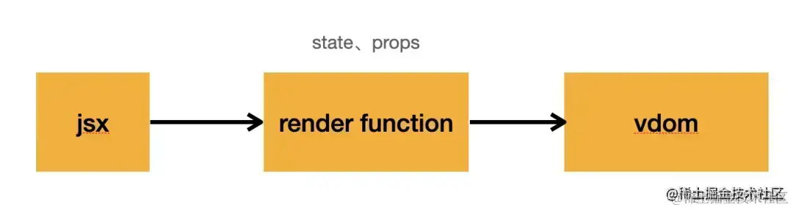
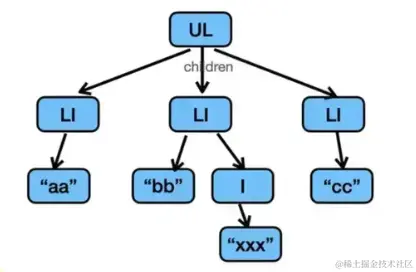
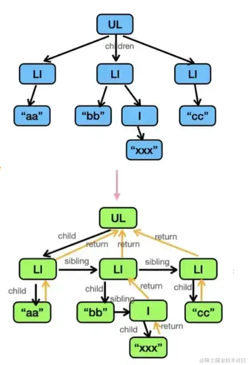
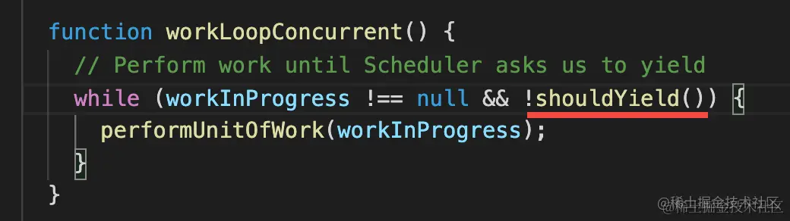
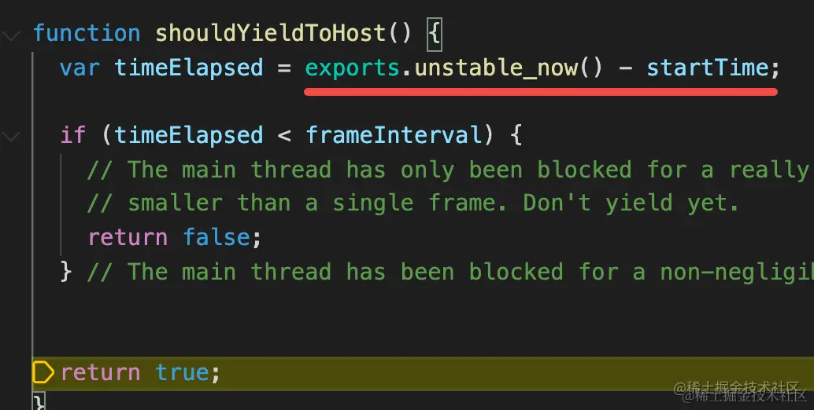

# mini-react

## react 渲染步骤

jsx -> renderFunction -> vDom -> fiber -> dom



vDom 通过树形结构组织起来



之后 react 会将 vDom 树转换为 fiber 链表，这个过程叫做 reconcile



fiber 会添加 child, sibling, return 属性来关联父子、兄弟节点

有了 fiber 后就可以按照 child -> sibling -> return 的顺序(深度优先)遍历整个 vDom 树，在遍历 fiber 时维护一个叫 `workInProgress` 的指向当前节点的指针，这样就可以在任意节点中断渲染，等待下一次渲染时继续。

这也是 react 并发特性的基础

在每次渲染 fiber 节点前，都会判断是否超过一定的时间间隔，是的话就会中断当前节点的渲染，将控制权交给浏览器，等待下一次渲染时继续。



对比示例

https://claudiopro.github.io/react-fiber-vs-stack-demo/stack.html

https://claudiopro.github.io/react-fiber-vs-stack-demo/fiber.html

在 reconcile 时，react 不止创建 fiber 节点，还会对新旧 fiber 节点做 diff 判断是新增、修改还是删除，然后打上对应标记。

构建好 fiber 后会再次遍历 fiber 链表，根据标记更新 dom，这个阶段叫做 commit。

这样一个完整的 react 渲染流程就结束了。

整体分为两个阶段：

1. render: 把 vDom 树转换为 fiber 链表的 reconcile 过程，由 Scheduler 调度，通过时间分片将计算分到多个帧中。
2. commit: 根据 fiber 标记更新 dom 的 commit 过程。

commit 又分三个小阶段：

1. before mutation: 执行 dom 操作前的准备工作，会在此时异步调度 effect 函数。
2. mutation: 执行 dom 操作。
3. layout: 操作 dom 后，useLayoutEffect 会在此时同步执行。

## 新建项目

### tsconfig.json

```json
{
  "compilerOptions": {
    "jsx": "react", // 支持 jsx
    "jsxFactory": "React.createElement" // jsx 转换后的创建函数
    // ...
  }
}
```

npx tsc -w 监听文件变化

npx http-server 启动一个静态服务器
